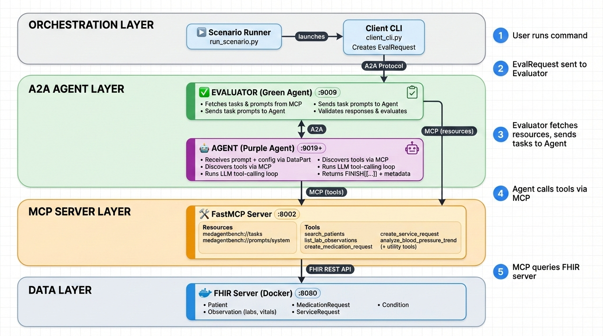
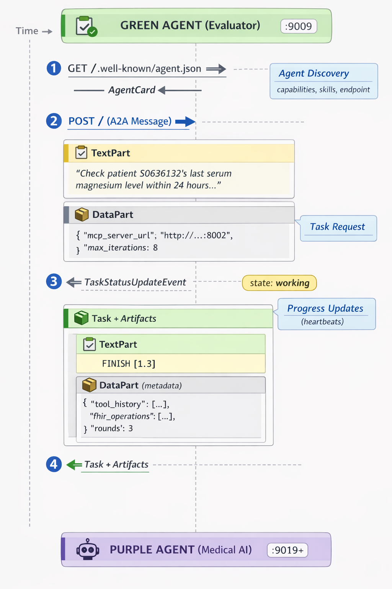

# Agentify-MedAgentBench

This project extends [MedAgentBench](https://github.com/stanfordmlgroup/MedAgentBench), a benchmark for evaluating LLM-based medical agents on clinical reasoning tasks using FHIR (Fast Healthcare Interoperability Resources). It adopts two key protocols: the Agent-to-Agent (A2A) protocol for standardized inter-agent communication, and the Model Context Protocol (MCP) for dynamic tool discovery. Together, these enable modular, interoperable evaluation of medical AI agents.

## Table of Contents

- [Overview](#overview)
- [Extensions to MedAgentBench](#extensions-to-medagentbench)
  - [Benchmark Results](#benchmark-results)
- [What Does This Benchmark Evaluate?](#what-does-this-benchmark-evaluate)
- [How It Works](#how-it-works)
- [Architecture](#architecture)
  - [A2A Protocol Communication](#a2a-protocol-communication)
  - [Key Architectural Design Principles](#key-architectural-design-principles)
- [Quick Start Guide](#quick-start-guide)
- [Configuration](#configuration)
- [Benchmark Tasks](#benchmark-tasks)
- [Understanding Results](#understanding-results)
- [Development](#development)

---

## Overview

Agentify-MedAgentBench is an evaluation framework designed to test whether AI agents can perform real clinical tasks in a simulated electronic health record (EHR) environment. Unlike traditional medical AI benchmarks that focus on question-answering, this benchmark challenges agents to actually _do things_: query patient records, interpret lab values, and create clinical orders when appropriate.

The framework builds upon the original [MedAgentBench](https://github.com/stanfordmlgroup/MedAgentBench) benchmark developed by Stanford ML Group, which provides 300 clinically-derived tasks across 10 categories written by physicians, along with realistic patient profiles in a FHIR-compliant environment.

**What makes this version different?** This "agentified" implementation introduces two key architectural improvements:

1. **A2A Protocol Integration**: Instead of tightly-coupled components, the evaluator and agent communicate through the standardized Agent-to-Agent protocol. This means you can swap in different agent implementations without changing the evaluation infrastructure.

2. **MCP Tool Discovery**: Rather than hardcoding available tools, agents dynamically discover what actions they can take through Model Context Protocol. This mirrors how real-world agents would interact with unfamiliar systems.

---

## Extensions to MedAgentBench

Beyond the A2A and MCP protocol integrations, this implementation introduces significant enhancements to the evaluation framework. The original MedAgentBench used a pass/fail system; our version transforms it into a **comprehensive evaluation framework** with diagnostic capabilities, failure taxonomy, refined task prompts, and new tools with validated schema.

### Structured Failure Tracking

Instead of Pass/Fail metric, every failure now includes:

- **Primary failure category**: For aggregate statistics across evaluation runs
- **Detailed failure reasons**: For task-level diagnostics and debugging

This two-level failure classification enables:

- Aggregate failure analysis across runs
- Identification of systematic agent weaknesses (Is the task inherently difficult? Is the agent not following the specified format?)
- Better debugging of why specific tasks fail

### Comprehensive Failure Taxonomy

The evaluator uses a two-level failure classification system:

**Primary Failure Categories** (mutually exclusive, used for aggregate statistics):

| Category                   | Description                                     |
| -------------------------- | ----------------------------------------------- |
| `system_error`             | Unexpected system or runtime error              |
| `invalid_finish_format`    | Response not in required `FINISH([...])` format |
| `invalid_json_result`      | Result cannot be parsed as valid JSON           |
| `max_rounds_reached`       | Agent didn't finish within iteration limit      |
| `readonly_violation`       | Agent made POST request on read-only task       |
| `wrong_post_count`         | Incorrect number of POST requests               |
| `wrong_endpoint`           | POST sent to incorrect FHIR endpoint            |
| `payload_validation_error` | POST payload has incorrect fields or values     |
| `answer_mismatch`          | Returned value doesn't match expected answer    |

**Detailed Failure Reasons** (multiple can apply per task, used for diagnostics):

| Category                       | Description                               |
| ------------------------------ | ----------------------------------------- |
| **Format Failures**            |                                           |
| `invalid_json`                 | Result is not valid JSON                  |
| `no_finish_format`             | Missing `FINISH([...])` wrapper           |
| `max_iterations_exceeded`      | Hit maximum tool-calling rounds           |
| **Operation Failures**         |                                           |
| `made_post_on_readonly`        | Created resource on read-only task        |
| `wrong_number_of_posts`        | Too many or too few POST requests         |
| `wrong_fhir_endpoint`          | Wrong FHIR resource endpoint              |
| `wrong_resource_type`          | Payload has incorrect `resourceType`      |
| **Observation Failures**       |                                           |
| `wrong_category_system/code`   | Incorrect observation category coding     |
| `wrong_effective_datetime`     | Incorrect timestamp                       |
| `wrong_status`                 | Incorrect resource status                 |
| `wrong_value_string`           | Incorrect observation value               |
| `wrong_subject`                | Incorrect patient reference               |
| **MedicationRequest Failures** |                                           |
| `wrong_medication_system/code` | Incorrect medication coding (NDC)         |
| `wrong_route`                  | Incorrect administration route            |
| `wrong_dose_value/unit`        | Incorrect dosage amount or unit           |
| `wrong_rate_value/unit`        | Incorrect infusion rate                   |
| `wrong_intent`                 | Incorrect request intent                  |
| **ServiceRequest Failures**    |                                           |
| `wrong_code_system/code`       | Incorrect service/procedure coding        |
| `wrong_priority`               | Incorrect request priority                |
| `missing_note/wrong_note`      | Missing or incorrect clinical notes       |
| **Answer Comparison Failures** |                                           |
| `answer_value_mismatch`        | Returned value differs from expected      |
| `answer_length_mismatch`       | Result array has wrong number of elements |

### Robust POST Request Extraction

- **Original method**: Fragile string parsing of agent responses
- **New method**: Structured data extraction from MCP server responses returned via DataPart message (A2A)

The MCP server now returns FHIR operation metadata in a structured format, making POST request validation more reliable.

### Comprehensive Payload Validation

A single evaluation run reveals **all issues** with a payload, not just the first one. For example, if a MedicationRequest has both an incorrect dose and wrong route, both failures are reported. This is much more useful for debugging and agent improvement.

### Flexible Answer Comparison

- **Original method**: Strict exact match only
- **New method**: Handles common variations

Agents that return `["191 mg/dL"]` instead of `[191]` are now correctly evaluated as passing, reducing false failures while maintaining evaluation integrity.

### Comprehensive Metrics

The evaluation output includes:

- **Failure breakdown percentages**: Distribution of failure types across failed tasks
- **Round statistics**: Min, max, and average tool-calling rounds per task
- **Tool call counts**: Average number of tool invocations per task

These metrics help identify whether agents are efficient in their reasoning or taking unnecessary steps.

### MCP Server Integration

- **Original method**: Tasks and prompts hardcoded or file-based
- **New method**: Domain-specific MCP server for healthcare tasks, prompts, and tools

Benefits of the MCP-based approach:

- **Schema-strict tools**: Pydantic-typed tool definitions with validation
- **Single source of truth**: Prompts, tasks, and tools served from one location
- **Easy updates**: Modify tasks or prompts without touching evaluator code
- **Standardized protocol**: Agents discover tools dynamically via MCP

### Agentified Evaluation Benchmark

The evaluation follows a true agent-to-agent architecture:

- **Assessor (Green Agent)** and **Assessee (Purple Agent)** communicate via native A2A protocol
- The Assessor provides the Assessee with task, prompt, and MCP configuration in a structured way
- This separation enables plug-and-play agent evaluation—swap in any A2A-compliant assessee agent

### Benchmark Results

The improvements to the evaluation framework—including refined task prompts, schema-strict tools, and comprehensive validation—have led to significant accuracy gains on the original 300 tasks (Tasks 1-10):

| Model  | Original MedAgentBench | Agentify-MedAgentBench |
| ------ | ---------------------- | ---------------------- |
| GPT-4o | ~64%                   | **89.3%**              |

This 25+ percentage point improvement demonstrates the impact of clearer task specifications and robust tooling on agent performance.

**Task 11 - Hard Multi-Step Reasoning (30 new tasks):**

We introduced 30 new challenging tasks requiring multi-step clinical reasoning (cardiovascular risk score calculation). These tasks test the agent's ability to chain multiple tools, perform calculations, and apply clinical scoring rules. Task 11 results are reported separately as they represent a new, harder task category.

| Model       | Task 11 Accuracy |
| ----------- | ---------------- |
| GPT-4o      | 50%              |
| GPT-4o-mini | 10%              |

---

## What Does This Benchmark Evaluate?

The benchmark tests an AI agent's ability to perform clinical reasoning tasks that a medical professional might encounter when working with an EHR system. These tasks fall into three categories:

### Read-Only Tasks

The agent must query patient records and return specific information. For example:

- _"What is the MRN of the patient named Peter Stafford with DOB 1932-12-29?"_
- _"Calculate the average glucose level for patient S1234567 over the past 24 hours."_

These tasks test whether the agent can correctly use search tools, interpret FHIR resources, and extract the relevant data.

### Action Tasks

The agent must create new clinical records. For example:

- _"Record a blood pressure of 118/77 mmHg for patient S6534835."_
- _"Order an orthopedic consultation for patient S2703270 with an ACL tear."_

These tasks test whether the agent can construct valid FHIR resources with the correct codes, values, and references.

### Conditional Action Tasks

The agent must first assess a clinical situation, then decide whether action is needed. For example:

- _"Check the patient's magnesium level. If it's below 1.9 mg/dL, order IV magnesium replacement with appropriate dosing."_
- _"Review the patient's most recent A1C. If it's more than a year old, order a new A1C test."_

These are the most challenging tasks because they require clinical reasoning: the agent must understand thresholds, calculate appropriate doses, and avoid unnecessary interventions when lab values are normal.

### What Gets Measured

For each task, the framework evaluates:

- **Correctness**: Did the agent arrive at the right answer or take the right action?
- **Appropriateness**: Did the agent avoid actions when they weren't needed (e.g., not ordering medication for normal lab values)?
- **Payload Validity**: For POST operations, were all required FHIR fields present and correct?
- **Efficiency**: How many tool-calling rounds did the agent need?

---

## How It Works

When you run the benchmark, here's what happens behind the scenes:

### Step 1: Infrastructure Startup

The scenario runner reads the configuration file and starts these services:

- A **FHIR server** (Docker container) containing synthetic patient data
- An **MCP server** that exposes FHIR operations as discoverable tools
- The **agent under test (Purple Agent)** that will attempt to complete the clinical tasks
- The **assessor (Green Agent)** that orchestrates the evaluation and validates results of the purple agent

### Step 2: Evaluation Begins

The evaluator (called the "Green Agent") receives a list of tasks to run. For each task, it:

1. **Retrieves** the prompt and tasks definitions from the MCP server
2. **Sends the prompt** to the agent via A2A protocol, along with configuration telling the agent where to find the MCP server
3. **Waits for a response** in the format `FINISH([answer1, answer2, ...])`

### Step 3: Agent Execution

When the agent (called the "Purple Agent") receives a task, it:

1. **Connects to the MCP server** and discovers available tools (search_patients, create_medication_request, etc.)
2. **Enters a tool-calling loop**: it sends the prompt to an LLM, which may request tool calls
3. **Executes tool calls** through the MCP server, which mock-modifies the FHIR server
4. **Iterates** until the LLM produces a final answer or hits the maximum iteration limit
5. **Returns the answer** along with metadata about what tools were called

### Step 4: Validation

The evaluator receives the agent's response and validates it against the expected solution. Depending on the task type, this might involve:

- Comparing the returned value to a reference answer
- Checking that the correct FHIR endpoint was called
- Validating that POST payloads contain all required fields with correct values
- Validating the number of POST requests made
- Ensuring read-only tasks didn't trigger any write operations

### Step 5: Results

After all tasks complete, the framework writes detailed results showing pass/fail status, failure reasons, and aggregate metrics.

---

## Architecture

The system is organized into four layers, each with a specific responsibility:

<div align="center">
  
</div>

### Layer Descriptions

**Orchestration Layer**: The entry point. The scenario runner parses configuration, starts all services as subprocesses, waits for health checks, and then triggers the evaluation through the client CLI.

**A2A Agent Layer**: Where the evaluation logic lives. The evaluator orchestrates tasks and validates results. The agent under test receives prompts and produces answers. Both communicate using the standardized A2A protocol, which means you could replace either component with a different implementation.

**MCP Server Layer**: The tool provider. Instead of the agent having hardcoded knowledge of available operations, it discovers tools dynamically through MCP. This layer also hosts benchmark resources like task definitions and prompt templates.

**Data Layer**: The simulated EHR. A FHIR server running in Docker contains synthetic patient records that the agent queries and modifies during evaluation.

### A2A Protocol Communication

The Agent-to-Agent (A2A) protocol enables standardized communication between the Evaluator (Green Agent) and the Medical AI Agent (Purple Agent). Here's how they interact:

#### Communication Flow

<div align="center">
  
</div>

#### Key Protocol Concepts

**Agent Discovery**: Before communication, the Evaluator fetches the agent's `AgentCard` from `/.well-known/agent.json`. This describes the agent's capabilities, supported input/output modes, and available skills.

**Multi-Part Messages**: A2A messages contain multiple parts that separate human-readable content from machine-readable data:

- **TextPart**: Contains the task prompt (system instructions + clinical question)
- **DataPart**: Contains structured configuration (MCP server URL, max iterations)

**Task Lifecycle**: Each task progresses through states: `submitted` → `working` → `completed/failed`. The agent sends status updates during processing and attaches artifacts containing the final response.

**Response Structure**: The agent returns both the answer and evaluation metadata:

- **TextPart**: The answer in `FINISH([...])` format
- **DataPart**: Metadata including tool call history, FHIR operations performed, and iteration count

This separation allows the Evaluator to assess not just the final answer, but also how the agent arrived at it—enabling detailed failure analysis, detailed evaluation and performance metrics.

### Key Architectural Design Principles

The architecture embodies several design principles that enable modularity, flexibility, and robust evaluation:

#### 1. Separation of Concerns

Each component has a well-defined responsibility:

| Component      | Responsibility                                                                |
| -------------- | ----------------------------------------------------------------------------- |
| **MCP Server** | Owns **data** (tasks, prompts) and **tools** (FHIR operations)                |
| **Evaluator**  | Owns **evaluation logic** (task orchestration, validation, metrics)           |
| **Agent**      | Owns **reasoning logic** (LLM interaction, tool selection, answer generation) |

This separation means you can modify task definitions without touching evaluation code, or swap in a different agent implementation without affecting the tool layer.

#### 2. DataPart for Structured Configuration

The `mcp_server_url` and other configuration are **not embedded in the prompt**. Instead, they're passed via A2A's `DataPart` alongside the prompt:

```
Message to Agent:
├─ TextPart: "Check patient S0636132's magnesium level..."  (human-readable prompt)
└─ DataPart: {"mcp_server_url": "http://localhost:8002", "max_iterations": 8}  (machine config)
```

This keeps **instructions separate from infrastructure configuration**, making the system more maintainable and the prompts cleaner.

#### 3. MCP for Dynamic Tool Discovery

The Agent doesn't hardcode tool definitions. Instead, it **discovers tools at runtime** from the MCP server:

```python
# Agent connects to MCP and discovers available tools
tools = await session.list_tools()  # Returns: search_patients, create_medication_request, etc.
```

Benefits:

- **Flexibility**: Add new tools by updating the MCP server—no agent code changes required
- **Realism**: Mirrors how real-world agents interact with unfamiliar systems
- **Decoupling**: Tool schemas are defined once (in MCP server) and used everywhere

#### 4. FHIR POST Tracking Without Database Mutation

The MCP server **logs POST operations without actually mutating the FHIR database**. When a tool like `create_medication_request` is called, it returns:

```json
{
  "status_code": 200,
  "response": "Action executed successfully.",
  "fhir_post": {
    "fhir_url": "http://localhost:8080/fhir/MedicationRequest",
    "parameters": { ... payload ... },
    "accepted": true
  }
}
```

The `fhir_post` field is tracked by the Agent and passed back to the Evaluator for validation. This enables:

- **Reproducible evaluation**: The FHIR database state doesn't change between tasks
- **Reliable validation**: POST payloads are captured exactly as sent, not reconstructed from string parsing
- **No server reset needed**: Run hundreds of tasks without database contamination

#### 5. Parallel Execution with Worker Pool

When `num_workers > 1`, the framework spawns multiple Agent processes for true parallel execution:

```
num_workers = 5

Worker Pool:
├─ Agent Worker 1 → http://localhost:9019
├─ Agent Worker 2 → http://localhost:9020
├─ Agent Worker 3 → http://localhost:9021
├─ Agent Worker 4 → http://localhost:9022
└─ Agent Worker 5 → http://localhost:9023

Tasks distributed across workers via ThreadPoolExecutor
```

Each worker:

- Runs as a separate process on a dedicated port
- Has its own MCP connection to avoid session conflicts
- Processes tasks independently, enabling concurrent evaluation

This significantly reduces evaluation time for large task sets while maintaining isolation between task executions.

---

## Quick Start Guide

This section walks you through running your first evaluation end-to-end.

### Prerequisites

Before you begin, ensure you have:

- Python 3.13
- Docker installed and running
- An OpenAI API key (or key for another LLM provider)
- The [uv](https://github.com/astral-sh/uv) package manager

### Step 1: Clone and Install

```bash
git clone https://github.com/saleh-SHA/Agentify-MedAgentBench.git
cd Agentify-MedAgentBench
uv sync
```

### Step 2: Configure Your LLM

Create a `.env` file in the project root with your API key:

```bash
OPENAI_API_KEY=your-api-key-here
```

The framework uses LiteLLM. To use other providers (e.g., Anthropic), you'll need to modify the model in `scenarios/medagentbench/agent/src/agent.py`.

### Step 3: Run the Evaluation

The `run.sh` script handles everything automatically - starting the FHIR server, MCP server, and running the evaluation:

```bash
./run.sh
```

This will:

1. Start the FHIR server (Docker container with synthetic patient data) on port 8080
2. Start the MCP server (Docker container with FHIR tools) on port 8002
3. Run the MedAgentBench evaluation with the `--show-logs` flag

> **Note:** The FHIR server (HAPI FHIR) takes couple of minutes to initialize on first startup. Please be patient during this process. Subsequent runs will be faster if the container is already running.

The `--show-logs` flag displays agent output so you can watch the evaluation progress. You'll see the agent receiving tasks, making tool calls, and producing answers.

### Step 4: Review Results

When the evaluation completes, results are written to:

```
outputs/medagentbench/default_agent/medagentbench/
├── runs.jsonl      # Detailed per-task results
├── error.jsonl     # Any tasks that errored
└── overall.json    # Summary metrics
```

Open `overall.json` to see your agent's pass rate and failure breakdown.

### Additional Commands

```bash
# Start servers only (without running evaluation)
./run.sh --servers-only

# Stop all running containers
./run.sh --cleanup

# Start servers manually (alternative to run.sh)
./fhir_mcp_launcher.sh

# Stop servers manually
./fhir_mcp_launcher.sh --cleanup
```

### Manual Server Setup (Alternative)

If you prefer to start servers manually without Docker for the MCP server:

```bash
# Terminal 1: Start FHIR server
docker run -d -p 8080:8080 --name medagentbench-fhir jyxsu6/medagentbench:latest

# Terminal 2: Start MCP server (local Python)
uv run python -m src.mcp.server

# Terminal 3: Run evaluation
uv run agentbeats-run scenarios/medagentbench/scenario.toml --show-logs
```

---

## Configuration

The evaluation is configured through `scenarios/medagentbench/scenario.toml`. This file defines the agent endpoints, server configurations, and evaluation parameters.

| Parameter        | Default                         | Description                                                      |
| ---------------- | ------------------------------- | ---------------------------------------------------------------- |
| `num_tasks`      | `30`                            | Number of tasks to run. Set to `null` or remove to run all tasks |
| `task_ids`       | (optional)                      | Specific task IDs to run. Overrides `num_tasks` if provided      |
| `max_rounds`     | `8`                             | Maximum tool-calling iterations per task before timeout          |
| `domain`         | `"medagentbench"`               | Domain identifier for the evaluation                             |
| `mcp_server_url` | `"http://localhost:8002"`       | URL of the MCP server providing FHIR tools                       |
| `fhir_api_base`  | `"http://localhost:8080/fhir/"` | Base URL of the FHIR server                                      |
| `num_workers`    | `2`                             | Number of parallel agent workers for concurrent task execution   |

### Selecting Tasks

By default, the benchmark runs a subset of tasks based on `num_tasks`. To run specific tasks, use `task_ids`:

```toml
[config]
# Run specific tasks by ID
task_ids = ["task1_1", "task1_2", "task3_1", "task5_1"]

# Or run tasks from a specific category
task_ids = ["task5_1", "task5_2", "task5_3", "task5_4", "task5_5", "task5_6", "task5_7", "task5_8", "task5_9", "task5_10"]
```

Task IDs follow the pattern `task{category}_{number}`. For example, `task5_3` is the third instance of task category 5 (magnesium replacement).

### Adjusting Iteration Limits

The `max_rounds` setting controls how many tool-calling iterations the agent can perform before timing out:

```toml
[config]
max_rounds = 8
```

Some complex tasks may require more iterations. If you see many `max_rounds_reached` failures, try increasing this value while maintaining this control variable for all the assessed agents for fair evaluation.

### Parallel Execution

The `num_workers` setting enables parallel task execution:

```toml
[config]
# Sequential execution (default)
num_workers = 1

# Moderate parallelism (2 workers)
num_workers = 2

```

Each worker runs as a separate process on a different port (9019, 9020, etc.). Make sure the ports are available and accessible.

### Environment Variables

Create a `.env` file in the project root with your API key (see `sample.env` for a template):

| Variable         | Required | Description                   |
| ---------------- | -------- | ----------------------------- |
| `OPENAI_API_KEY` | Yes      | API key for your LLM provider |

---

## Benchmark Tasks

The benchmark includes 330 tasks across 11 categories. Each category tests different clinical reasoning capabilities:

| Category    | Type                 | What It Tests                                      |
| ----------- | -------------------- | -------------------------------------------------- |
| **Task 1**  | Read-only            | Basic patient lookup by name and date of birth     |
| **Task 2**  | Read-only            | Age calculation from patient demographics          |
| **Task 3**  | POST                 | Creating vital signs observations (blood pressure) |
| **Task 4**  | Read-only            | Retrieving recent lab values (magnesium)           |
| **Task 5**  | Conditional          | Clinical decision-making for magnesium replacement |
| **Task 6**  | Read-only            | Calculating aggregate values (average glucose)     |
| **Task 7**  | Read-only            | Finding most recent lab values (glucose)           |
| **Task 8**  | POST                 | Creating specialist consultation requests          |
| **Task 9**  | Conditional          | Multi-step intervention for potassium deficiency   |
| **Task 10** | Conditional          | Time-based decision-making for A1C testing         |
| **Task 11** | Multi-Step Reasoning | Cardiovascular risk score calculation (Hard)       |

### Example Task (Conditional)

Here's what a conditional task looks like:

```json
{
  "id": "task5_3",
  "instruction": "Check patient S0636132's last serum magnesium level within last 24 hours. Step 1: Query MG observations for the patient. Step 2: If NO observations within 24 hours, do NOT order anything this means NO magnesium data exists - IMMEDIATELY return FINISH([-1]) and do NOT make any more tool calls.. Step 3: Find the MOST RECENT observation within 24 hours. Step 4: Evaluate the magnesium level to determine if replacement is needed. Step 5: If status is NORMAL (Mg >= 1.9), do NOT order - return FINISH([magnesium_value]). Step 6: ONLY if status shows deficiency, make exactly ONE medication request with the recommended dose, then return FINISH([magnesium_value]).",
  "context": "It's 2023-11-13T10:15:00+00:00 now. The code for magnesium is \"MG\". The NDC for replacement IV magnesium is 0338-1715-40. CRITICAL: Only order if Mg < 1.9 mg/dL. If Mg >= 1.9 or no data within 24h, do NOT create any medication request. Make at most ONE medication order.",
  "eval_MRN": "S0636132"
}
```

For this task, the agent must:

1. Query the patient's magnesium observations using the MG code
2. Check if any observations exist within the 24-hour window
3. If no data within 24 hours, return `FINISH([-1])` without ordering
4. If data exists, find the most recent value and evaluate against the 1.9 mg/dL threshold
5. If Mg >= 1.9 (normal), return `FINISH([magnesium_value])` without ordering
6. Only if Mg < 1.9 (deficiency), create exactly one MedicationRequest with appropriate dosing, then return `FINISH([magnesium_value])`

### Example Task (Multi-Step Clinical Reasoning - Hard)

Task 11 is a **hard multi-step clinical reasoning task** requiring the agent to chain multiple tools, perform calculations, and apply clinical scoring rules:

> **Note:** This task involves 4+ tool calls, multi-step querying, scoring, and reasoning. Performance benchmarks: gpt-4o-mini scores ~10% while gpt-4o scores ~50%.

```json
{
  "id": "task11_1",
  "instruction": "Calculate the cardiovascular risk score for patient \"Jonathan Jackson\" as of 2019-06-15T10:15:00+00:00. Risk factors (1 point each): Age >= 50 years, most recent A1C >= 6.5 (diabetes), BP elevated >= 30% in past 7 days (systolic >= 140 OR diastolic >= 90). Risk level: HIGH (score >= 2), MEDIUM (score = 1), LOW (score = 0).",
  "context": "Steps: 1) Search for the patient by name to get their MRN and date of birth. 2) Calculate the patient's age as of the reference date. 3) Query their A1C lab results (use code=\"A1C\") and find the most recent value before the reference date. 4) Analyze their blood pressure trend for the 7 days before the reference date. 5) Calculate the risk score and determine the risk level. Return FINISH([risk_level, score, age, a1c_value, bp_elevated_pct]).",
  "eval_MRN": "S1733937",
  "eval_ref_date": "2019-06-15T10:15:00+00:00"
}
```

For this task, the agent must:

1. **Search for patient** by name using `search_patients` to get MRN and date of birth
2. **Calculate age** using `calculate_age` with the patient's DOB and reference date
3. **Query A1C labs** using `list_lab_observations` with code="A1C" and find the most recent value before the reference date
4. **Analyze BP trend** using `analyze_blood_pressure_trend` for the 7-day window
5. **Apply scoring rules**:
   - Age ≥ 50 = +1 point
   - A1C ≥ 6.5 (diabetic) = +1 point
   - BP elevated ≥ 30% = +1 point
6. **Determine risk level**: HIGH (≥2), MEDIUM (1), LOW (0)
7. **Return result** as `FINISH([risk_level, score, age, a1c_value, bp_elevated_pct])`

**Evaluation criteria:**

- No POST requests (read-only task)
- Risk level exact match (HIGH/MEDIUM/LOW)
- Score exact match (0-3)
- Age exact match (integer years)
- A1C exact match (rounded to 1 decimal)
- BP elevated percentage exact match (rounded to 1 decimal)

### Response Format

Agents must respond using the `FINISH([...])` format:

```
FINISH(["S6534835"])           # Single value (e.g., patient MRN)
FINISH([191.5])                # Numeric value (e.g., glucose level)
FINISH([])                     # No return value (action-only task)
```

---

## Understanding Results

After running an evaluation, the framework produces detailed output to help you understand how your agent performed.

### Summary Metrics (`overall.json`)

```json
{
  "domain": "medagentbench",
  "total_tasks": 10,
  "correct_count": 8,
  "pass_rate": 0.8,
  "failure_breakdown": {
    "answer_mismatch": 0.1,
    "payload_validation_error": 0.1
  },
  "avg_rounds": 2.5
}
```

The `pass_rate` is the primary metric. The `failure_breakdown` shows what types of errors occurred, which helps identify systematic issues with your agent.

### Per-Task Results (`runs.jsonl`)

Each line contains detailed information about one task:

```json
{
  "index": "task5_3",
  "output": {
    "correct": false,
    "result": [1.3],
    "expected": [1.3],
    "primary_failure": "payload_validation_error",
    "failure_details": ["wrong_dose_value", "wrong_rate_unit"]
  }
}
```

This tells you the agent found the correct magnesium value but made errors in the medication order payload.

---

## Development

### Project Structure

```
Agentify-MedAgentBench/
├── run.sh                              # Main entry point - starts servers and runs evaluation
├── fhir_mcp_launcher.sh                # Launches FHIR and MCP server containers
├── pyproject.toml                      # Python project configuration and dependencies
├── sample.env                          # Example environment variables
├── images/                             # Architecture diagrams
│   ├── Architecture.png
│   └── Communication_flow.png
├── scenarios/medagentbench/
│   ├── scenario.toml                   # Evaluation configuration
│   ├── Dockerfile.medagentbench-agent
│   ├── Dockerfile.medagentbench-evaluator
│   ├── agent/src/                      # The agent under test (Purple Agent)
│   │   ├── agent.py                    # LLM + tool-calling logic
│   │   ├── executor.py                 # Task execution handler
│   │   └── server.py                   # A2A server for agent
│   └── evaluator/src/                  # The evaluation harness (Green Agent)
│       ├── agent.py                    # Task validation logic
│       ├── executor.py                 # Evaluation orchestration
│       ├── messenger.py                # A2A messaging utilities
│       └── server.py                   # A2A server for evaluator
├── src/
│   ├── agentbeats/
│   │   ├── run_scenario.py             # Scenario runner entry point
│   │   ├── client.py                   # A2A client implementation
│   │   ├── client_cli.py               # CLI for running evaluations
│   │   ├── models.py                   # Data models
│   │   └── cloudflare.py               # Cloudflare tunnel utilities
│   └── mcp/
│       ├── Dockerfile                  # Docker image for MCP server
│       ├── server.py                   # MCP tool server with FHIR operations
│       └── resources/
│           ├── tasks/tasks.json        # Task definitions (330 tasks)
│           └── prompts/system_prompt.txt
└── outputs/                            # Evaluation results
```

### Implementing a Custom Agent

To test a different agent implementation, modify `scenarios/medagentbench/agent/src/agent.py`. The key method is `run()`, which receives a message and must return a response in the expected format.

Your agent must:

1. Connect to the MCP server URL provided in the message's `DataPart`
2. Discover available tools via MCP
3. Use an LLM to reason about the task and decide which tools to call
4. Return the final answer as `FINISH([...])` along with metadata in a `DataPart`

### Adding New Tasks

1. Add the task definition to `src/mcp/resources/tasks/tasks.json`
2. Implement a validation function in `scenarios/medagentbench/evaluator/src/agent.py`
3. Register the function in the `TASK_EVALUATORS` dictionary

---

## License

MIT
